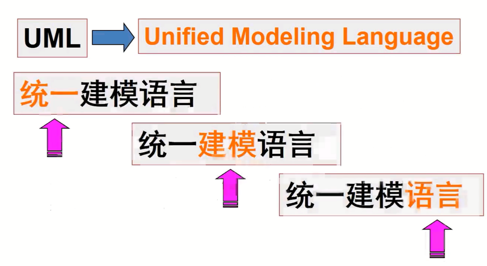

# DesignPattern
Design pattern based C++

## UML和设计模式导论

### 1.UML的使用



## 简单工厂模式


```
工厂（Factory）：整个模式的核心，负责实现创建所有实例的内部逻辑。
抽象产品（Product）：所有具体产品的父类，负责描述所有实例所共有的公共接口。
具体产品（ConcreteProduct）：最终创建的具体产品
```


```
实现了客户端和与具体类实现的解耦
Factory主要根据传入参数new不同的类对象返回
简单工厂需要传参数不符合开闭原则
每次增加一个子类需要修改工厂中的代码
```

```
#include<iostream>
#include<bits/stdc++.h>
using namespace std;
class Car
{
public:
    virtual void createCar()=0;
};
class CarA:public Car
{
public:
    void createCar()
    {
        cout<<"CarA is created"<<endl;
    }
};
class CarB:public Car
{
public:
    void createCar()
    {
        cout<<"CarB is created"<<endl;
    }
};
class Factory
{
public:
    static Car* FactoryCreateCar(char name)
    {
        if(name=='A')
        {
            return new CarA();
        }
        if(name=='B')
        {
            return new CarB();
        }
    }
};
int main()
{
    Car* car=Factory::FactoryCreateCar('B');
    car->createCar();
    return 0;
}
```

### 简单工厂的动态实现

模拟Java中的反射，C++不支持反射

反射解决的问题：**如何通过类的名称字符串来生成类的对象。比如有一个类 ClassA，那么如何通过类名称字符串 “ClassA” 来创建类的对象呢**


```
#include<iostream>
#include<bits/stdc++.h>
using namespace std;
//动态对象创建类
//该类包含一个map实现"NAME"->对象生成函数的反射机制
//该类使用单例模式实现，有注册名字+回调函数的接口reg
//该类有getbyname接口，通过名字"name"调用回调函数(new 对象并返回)
class ObjCreate
{
private:
    map<string,function<void*(void)>> m_map;
    ObjCreate()=default;
    ObjCreate(const ObjCreate& obj)=delete;
    ObjCreate& operator=(const ObjCreate& obj)=delete;
public:
    static ObjCreate& getObjInstance()
    {
        static ObjCreate obj;
        return obj;
    }
    void reg(string name,function<void*(void)> func)
    {
        m_map.insert({name,func});
    }
    void* getbyname(string name)
    {
        auto it=m_map.find(name);
        if(it==m_map.end())
        {
            return nullptr;
        }
        else
        {
            return it->second();
        }
    }
};
//注册行为调用类
class regAction
{
public:
    regAction(string name,function<void*(void)> func)
    {
        ObjCreate::getObjInstance().reg(name,func);
    }
};
//使用宏定义注册新"name"+回调函数，只需要REGISTER_DECLARE(name)便可以注册到map中
//宏定义中#->转化为字符串，##表示拼接
#define REGISTER_DECLARE(class_name) \
	class_name* ObjectCreator##class_name() \
	{ \
		return new class_name; \
	} \
	regAction g_Register##class_name(#class_name, (function<void*(void)>)ObjectCreator##class_name);

class Fruit
{
public:
    virtual void eat()=0;
};

class apple:public Fruit
{
public:
    virtual void eat()
    {
        cout<<"吃苹果"<<endl;
    }	
};
//将该类注册到对象创建类的map中去
REGISTER_DECLARE(apple);

class banana:public Fruit
{
public:
    virtual void eat()
    {
        cout<<"吃香蕉"<<endl;
    }
private:
};
REGISTER_DECLARE(banana);

class Factory
{
public:
	static Fruit* CreateFruitObject(const std::string& name)
	{
		return static_cast<Fruit*>(ObjCreate::getObjInstance().getbyname(name));
	}
};


int main()
{
    Fruit* fru=Factory::CreateFruitObject("apple");
    fru->eat();
    fru=Factory::CreateFruitObject("banana");
    fru->eat();
    return 0;
}
```

